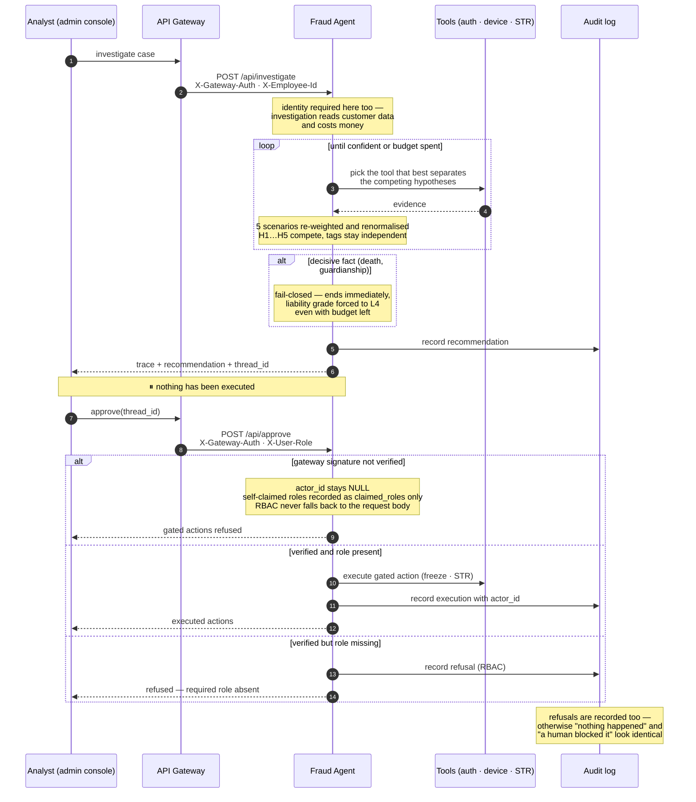
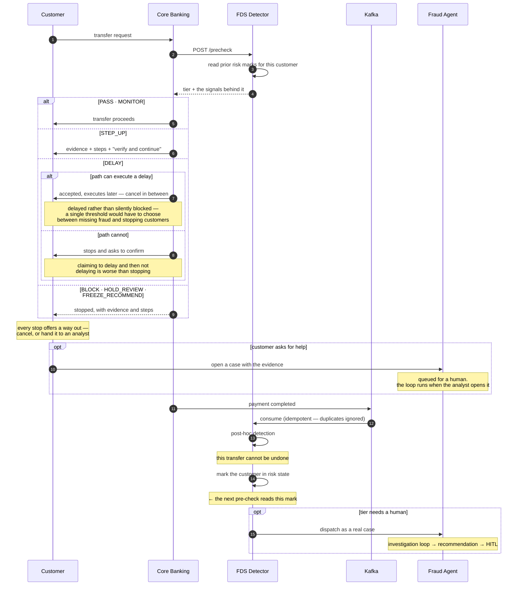

# AI Agents Under Banking Internal Controls

*Team project · 5 people*


       

In a financial marketplace, **serving demand creates risks the financial
institution has to manage** — credit risk when someone borrows, and fraud and
settlement risk when money moves.

AI agents can help investigate these risks by connecting data, documents, and
policies across systems. But **how much autonomy should a financial institution
safely give an agent?**

We built a banking system where **agents investigate and recommend, while
identity, permissions, service boundaries, policy, human approval, and
auditability constrain what they can see and do.**

**My part**

- **Customer & auth** — customer / party model · JWT and certificate login ·
  step-up approval for fund movement · role-based access (`BankRole`) · access
  audit logging · per-customer transfer limits
- **Fraud investigation agent** — bounded investigation loop · evidence
  gathering · HITL approval gating · case-scoped tool access · deterministic
  scoring of tool choices · consumer-facing explanation of why a transfer
  stopped, tailored by age band
- **Frontend** — internet banking and admin console

After the team phase I continued on the fork: fixing the double-entry check to
verify persisted rows, adding a pre-check that blocks transfers before money
moves, extracting a shared agent harness, and carrying the detector's reasoning
through to the customer — the evidence existed but was being logged and
discarded before it reached the screen.

**549 agent-evaluation tests**, 0 failures — HITL gate, fail-closed and endpoint identity pinned deterministically without an LLM key

---

## Architecture

```
┌─────────────────────────────────────────────────────────────────────────────┐
│                              CHANNELS                                       │
│                                                                             │
│        Customer Web          Employee Admin             AI Bot              │
│             │                       │                      │                 │
└─────────────┼───────────────────────┼──────────────────────┼────────────────┘
              │                       │                      │
              └───────────────────────┼──────────────────────┘
                                      ▼
┌─────────────────────────────────────────────────────────────────────────────┐
│                            API GATEWAY                                      │
│                                                                             │
│  External Authentication                                                    │
│  ├─ JWT / Identity                                                          │
│  ├─ Customer / Employee Context                                             │
│  ├─ RBAC                                                                    │
│  ├─ Routing / CORS                                                          │
│  └─ External API Boundary                                                   │
│                                                                             │
└──────────────────────────────────┬──────────────────────────────────────────┘
                                   │
                     ──────────────┼──────────────
                         TRUST BOUNDARY #1
                     External → Internal
                                   │
                                   ▼
┌─────────────────────────────────────────────────────────────────────────────┐
│                            CORE BANKING                                     │
│                                                                             │
│  ┌───────────────────────────────────────────────────────────────────────┐  │
│  │                    INTERNAL SECURITY BOUNDARY                          │  │
│  │                                                                       │  │
│  │  Service Authentication                                               │  │
│  │  ├─ Credential                                                          │  │
│  │  ├─ Credential Hash → Service Identity                                 │  │
│  │  └─ Service Principal                                                   │  │
│  │                                                                       │  │
│  │  Service Authorization                                                  │  │
│  │  ├─ Operation Permission                                                │  │
│  │  ├─ Resource / Account Scope                                            │  │
│  │  ├─ Amount Limit                                                        │  │
│  │  └─ Fail-Closed                                                         │  │
│  │                                                                       │  │
│  │  Audit                                                                   │  │
│  │  └─ Authentication / Authorization Decision History                    │  │
│  │                                                                       │  │
│  └───────────────────────────────┬───────────────────────────────────────┘  │
│                                  │                                          │
│             ┌────────────────────┼────────────────────┐                     │
│             │                    │                    │                     │
│             ▼                    ▼                    ▼                     │
│      ┌──────────────┐     ┌──────────────┐     ┌──────────────┐            │
│      │   CUSTOMER   │     │    DEPOSIT   │     │     LOAN     │            │
│      │   / PARTY    │     │    / SAVING  │     │    / CREDIT  │            │
│      │              │     │              │     │              │            │
│      │ CIF / Party  │     │ Accounts     │     │ Contracts    │            │
│      │ Auth / Role  │     │ Balance      │     │ Principal    │            │
│      │ Consent SoR  │     │ Deposit      │     │ Interest     │            │
│      │ Audit        │     │ Transactions │     │ Repayment    │            │
│      └──────────────┘     └──────┬───────┘     └──────┬───────┘            │
│                                  │                    │                     │
│                                  └────────┬───────────┘                     │
│                                           ▼                                 │
│                              ┌─────────────────────┐                        │
│                              │       PAYMENT       │                        │
│                              │                     │                        │
│                              │ Payment Instruction │                        │
│                              │ Idempotency         │                        │
│                              │ Clearing            │                        │
│                              │ Internal Payment    │                        │
│                              └──────────┬──────────┘                        │
│                                         │                                  │
│                          ────────────────┼────────────────                   │
│                              TRANSACTION BOUNDARY                           │
│                                         │                                  │
│                                         ▼                                  │
│                              ┌─────────────────────┐                        │
│                              │       LEDGER        │                        │
│                              │                     │                        │
│                              │ Double Entry        │                        │
│                              │ Journal             │                        │
│                              │ Journal No          │                        │
│                              │ Loan Receivable     │                        │
│                              │ Interest Revenue    │                        │
│                              │ Reversal            │                        │
│                              └──────────┬──────────┘                        │
│                                         │                                  │
│                              ┌──────────▼──────────┐                        │
│                              │   OUTBOX / SAGA      │                        │
│                              │ Transaction Events   │                        │
│                              └──────────┬──────────┘                        │
│                                         │                                  │
└─────────────────────────────────────────┼───────────────────────────────────┘
                                          │
                         ─────────────────┼────────────────
                              TRUST BOUNDARY #2
                              Sync → Async
                                          │
                                          ▼
┌─────────────────────────────────────────────────────────────────────────────┐
│                         ASYNC / RISK LAYER                                  │
│                                                                             │
│   ┌────────────────┐     ┌────────────────┐     ┌────────────────────────┐ │
│   │     KAFKA      │────▶│     SPARK      │────▶│   FDS POST DETECTOR    │ │
│   │ Events / MQ    │     │ Windowed Agg.  │     │ Post-time Detection    │ │
│   └───────┬────────┘     └────────────────┘     └────────────────────────┘ │
│           │                                                                 │
│           ▼                                                                 │
│   ┌─────────────────────────────────────────────────────────────────────┐   │
│   │                         AI / DECISION                                │   │
│   │                                                                     │   │
│   │  FDS Fraud Agent ──► Policy / Decision ──► HITL                     │   │
│   │  Consultation Agent                                                │   │
│   │  Loan Review Agent                                                  │   │
│   │  Document Agent                                                     │   │
│   │                                                                     │   │
│   │  AI does NOT become the final authority over the ledger.            │   │
│   └─────────────────────────────────────────────────────────────────────┘   │
│                                                                             │
└─────────────────────────────────────────────────────────────────────────────┘
                                          │
                                          ▼
┌─────────────────────────────────────────────────────────────────────────────┐
│                          EXTERNAL FINANCIAL SYSTEMS                          │
│                                                                             │
│                 KFTC / BOK / Clearing / Settlement / Reconciliation         │
│                                                                             │
└─────────────────────────────────────────────────────────────────────────────┘


┌─────────────────────────────────────────────────────────────────────────────┐
│                              DATA LAYER                                     │
│                                                                             │
│  Customer DB          Deposit DB          Payment DB          Loan DB        │
│      │                    │                   │                  │           │
│      │                    │                   │                  │           │
│      └─────────────── Domain-owned data ─────┴──────────────────┘           │
│                                                                             │
│                     PostgreSQL · Redis · Vector Store                       │
│                                                                             │
│  Loan Subsidiary Accounting ────────────────┐                               │
│                                             ▼                               │
│                                      Reconciliation                         │
│                                             ▲                               │
│                                             │                               │
│  Ledger (GL / SoR) ────────────────────────┘                               │
│                                                                             │
└─────────────────────────────────────────────────────────────────────────────┘


┌─────────────────────────────────────────────────────────────────────────────┐
│                            AUDIT / OBSERVABILITY                            │
│                                                                             │
│  Security Audit          Transaction Audit          AI Audit                │
│  ├ Authentication        ├ Payment ID              ├ Agent Trace           │
│  ├ Authorization         ├ Journal No              ├ Decision              │
│  ├ Service Identity      ├ Idempotency             ├ Tool Call             │
│  └ Permission Change     └ Reversal                └ HITL                  │
│                                                                             │
│        Prometheus · Grafana · Loki · Phoenix · WORM Audit                  │
│                                                                             │
└─────────────────────────────────────────────────────────────────────────────┘
```

---

## Flows

The architecture above shows what exists. These two show *when* — where the
system stops, and what happens when a step fails. Neither can be read off a
component diagram.

### Human approval on a fraud investigation

The agent investigates and recommends. It never executes. A person's identity is
only trusted when it arrives through the gateway, because this sidecar is
reachable directly and a hand-written header would otherwise buy the same
authority. The detector opens cases too, and it is not a person — it presents a
separate shared secret and is recorded as `system:fds-detector`, so a machine's
case is never attributed to someone who did not open it.



### A transfer that fraud detection delays, and the loop it feeds

Detection before the money moves is a gate. Detection after it has moved cannot
undo the transfer — so instead it marks the customer, and that mark is what the
*next* transfer's pre-check reads. The loop closes across three services.



Settlement leaves the system as well. Interbank legs are written to an outbox
and cleared through KFTC and BOK, with a reconciliation engine that records
breaks rather than silently correcting them.

---

## Stack

| | |
|---|---|
| Backend | Java 17 · Spring Boot 3.3.5 · Gradle multi-module |
| Agents | Python 3.11 · FastAPI · LangGraph |
| Frontend | Next.js · TypeScript |
| Data | PostgreSQL 16 (pgvector) · Redis 7 · Kafka 3.8 (KRaft) |
| Runtime | Docker Compose |
| Observability | Prometheus · Grafana · Loki · Phoenix |

---

## Trade-offs

Agent behaviour is verified **without an LLM key** — the fraud agent runs in mock
mode and loan review under a stub client — so the guarantees below are pinned
deterministically rather than sampled from a model.

| Suite | Tests |
|---|---|
| Fraud investigation agent | **127**, 0 failures |
| Auto loan review agent | **422**, 0 failures |
| Total | **549** — 0 failures · 0 errors · 0 skipped |

| What is pinned | |
|---|---|
| HITL gate | no approval → no execution; RBAC denies without the role |
| Fail-closed | a decisive fact ends the investigation even with budget left |
| Path branching | H1 confirms in two loops; H2 takes a different route (device → auth) |
| Endpoint identity | forged headers rejected; customer tokens rejected on investigation endpoints |
| Grounding | citation existence (19 tests) · prompt injection defence (17 tests) |
| Fairness | bias reporting and drift alerting (16 tests) |
| **Adoption rate** | instrumented — approvals and rejections are each recorded, pinned by test. The **value** comes from operation, not from a test run. |

LLM output *quality* — plausibility ranges and red-flag detection — is scored
against a live model in a separate workflow and requires an API key.

### Java for the core, Python for the agents

**Buys** — money movement stays in a stack with mature transaction and migration
tooling, while agents are written where the AI ecosystem actually lives and can
be iterated on without redeploying core banking.
**Costs** — two toolchains, two deployment paths, and a contract boundary between
them that can drift. Frontend response types are generated from the backend
OpenAPI specification rather than written by hand, which closes one side of that
gap but not all of it.

### A database per service

**Buys** — services evolve without coordinating schema changes, and a failure is
contained to the service that caused it.
**Costs** — no cross-service joins. Anything that spans services has to be
carried by events, and consistency becomes something to design rather than
something the database provides.

### Fraud checked before the money moves

Post-hoc detection tells you a transfer was fraudulent after it settled.

**Buys** — a pre-authorization check runs on the transfer path, and the response
is tiered by suspicion level rather than binary. When a transfer stops, the
customer is told **why** and **what to do now**: the detector's own evidence
sentences, action steps that differ by which signal fired, and a way out —
cancel, or hand the case to an analyst. Post-hoc detection marks the customer,
and that mark is what the next transfer's pre-check reads — a loop no single
service can hold.
**Costs** — latency on the transfer path, and false positives stop legitimate
transfers. The tiered response exists because a single threshold would have to
choose between missing fraud and blocking customers.

A tier is only worth as much as the path that can carry it. Delay means *accept
now, execute later, cancel in between* — which needs a scheduler, and only the
intra-bank payment path has one. Where a delay cannot be executed the transfer
is not quietly let through; it stops and asks for confirmation instead. Claiming
to delay and then not delaying is the failure this avoids.

### Outbox and compensation for external clearing

Interbank transfers leave the system. KFTC and BOK can fail after we have already
committed.

**Buys** — messages are not lost when the external leg fails, and a failed
settlement compensates rather than leaving a booking half-done.
**Costs** — eventual consistency, plus an outbox to operate and monitor. There is
a window where the ledger and the external system disagree.

### Agents recommend, people approve — and adoption is the metric

**Buys** — autonomy has a boundary. Loan review escalates to a four-eye approval
when bias thresholds are exceeded; the fraud investigation agent produces a
recommendation and only acts after an analyst approves under RBAC. Because the
human decision is recorded, the agent can be measured by **how often its
recommendation is actually adopted** rather than by offline accuracy, and the
document agent by **how often its automatic verdict is overturned**. Those metrics
run as scheduled evaluation workflows in CI, alongside bias and drift monitoring
over `agent_audit_log`.
**Costs** — throughput is capped by human review, and every agent action needs a
logged decision to be measurable at all. An agent that is never wrong but never
adopted still counts as a failure under this metric, which is the intended
behaviour.

### Normalising the data dictionary across live schemas

**Buys** — 52 boolean-carrying `CHAR(1)` columns across four schemas became real
booleans, and amounts were unified on a single integer type. Ambiguity at service
boundaries disappears rather than being handled case by case.
**Costs** — a migration against tables already in use, coordinated across
services that were being developed in parallel. The alternative — leaving the
inconsistency and documenting it — would have been cheaper on the day and more
expensive afterwards.

## Run locally

```bash
cp .env.sample .env                   # fill AGENT_PII_SALT and the two FRAUD_* secrets
./gradlew build                       # LLM keys are optional — stub/mock otherwise
docker compose up -d                  # 30 containers, ~17 GB RAM
cd web && npm run dev                 # http://localhost:3001
```

The `FRAUD_*` secrets are shared secrets, not credentials — any value works as
long as both sides match. Left empty, the fraud features fail closed and go
quiet: the admin investigation screen returns 403, cases the detector hands over
bounce, and a stopped transfer falls back to generic guidance instead of one
matched to the customer. Nothing errors, which is why they are called out here.

The gateway is the only entry point — `http://localhost:8080`. Demo login: `user01` / `Employee1234!`.

Docker Desktop needs its memory raised past the 8 GB default; the full stack does not fit.
This slice does — 13 containers, ~3 GB in use, covering customer, deposits, transfers and loans
(`depends_on` pulls in the databases, Kafka and the review agent):

```bash
docker compose up -d customer-service core-banking-a api-gateway
```

```bash
docker compose --profile doc up -d    # document agent (MinIO, Vault)
docker compose --profile rag up -d    # Elasticsearch, Kibana
```

`docker compose up -d <service>` reuses an existing image instead of rebuilding,
so a container can quietly run yesterday's code while looking healthy.
`scripts/check-stale-images.ps1` compares each image against its source and says
which ones to rebuild.

## Docs

| | |
|---|---|
| [docs/README.md](docs/README.md) | Documentation index |
| [docs/decisions/](docs/decisions/) | Why things are built this way |
| [docs/OPEN_ITEMS.md](docs/OPEN_ITEMS.md) | What is not done yet |
