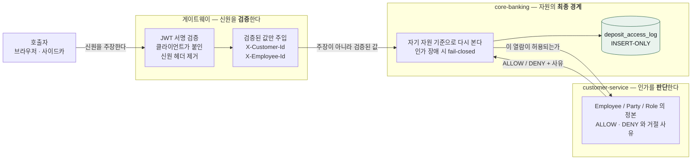
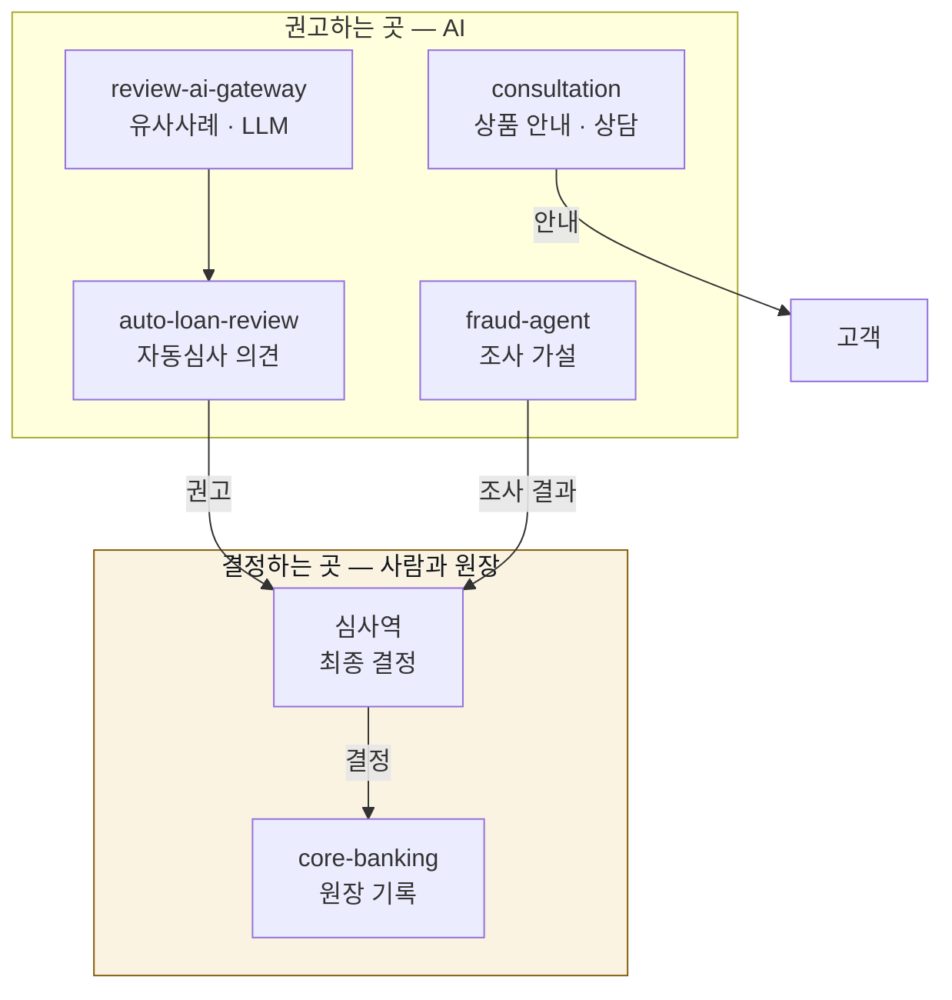

# 시스템 구조 — 상자보다 선

<!-- plan-status -->
> **상태: ✅ 구현됨** — 2026-08-29 기준 `docker-compose.yml` 과 대조해 그렸다.
> 서비스 목록이 어긋나면 `ArchitectureDiagramFreshnessTest` 가 잡는다.
>
> 상태 어휘는 넷뿐이다(구현됨 · 진행 중 · 설계만 · 폐기).
> 전체 목록은 [`docs/plan/README.md`](plan/README.md).

이전 그림([`architecture.svg`](#옛-그림을-지운-이유))에는 상자가 다 있었는데 **선이 없었다.**
무엇이 무엇을 부를 수 있는지, 어디가 신뢰 경계인지, 어느 저장소에 무엇이 담기는지가
빠져 있었다. 상자만 있는 그림은 "이런 것들이 있다" 는 말이지 구조가 아니다.

그래서 여기서는 셋을 그린다 — **존 경계**(누가 누구에게 닿을 수 있나),
**신뢰 경계**(누가 검증하고 누가 판단하나), **데이터 등급**(어디에 무엇이 있나).

---

## 1. 존 경계 — 망으로 갈라 둔 것

닿을 수 있음과 없음은 코드가 아니라 **망 소속**이 정한다. `internal: true` 인 망은
바깥으로 나가지 못한다.

```mermaid
flowchart TB
    subgraph ext[" "]
        USER["사용자<br/>브라우저"]
        LLM["외부 LLM<br/>Anthropic · OpenAI"]
        KFTC["KFTC / BOK<br/>대외 결제망"]
    end

    subgraph default["default — 기본망"]
        GW["api-gateway<br/>:8080"]
        CUST["customer-service<br/>:8081"]
        CBA["core-banking-a<br/>:8082"]
        CBB["core-banking-b<br/>:8180<br/><i>타행(다온뱅크)</i>"]
        LOAN["loan-service<br/>:8083"]
        FDSD["fds-detector<br/>:8092"]
        KAFKA["Kafka"]
    end

    subgraph agentnet["agent-net — 사이드카망"]
        CONS["consultation-service<br/><i>호스트 포트 없음</i>"]
        DOC["doc-agent<br/><i>profile: doc</i>"]
    end

    subgraph agentclosed["agent-closed — internal: true"]
        ALR["auto-loan-review"]
        RAG["review-ai-gateway"]
    end

    subgraph fraudnet["fraud-internal — internal: true"]
        FRAUD["fraud-agent"]
    end

    subgraph consdata["consultation-data — internal: true"]
        CONSDB[("consultation-db<br/><i>상담 자기 자료만</i>")]
    end

    USER --> GW
    GW --> CUST
    GW --> CBA
    GW --> LOAN
    GW --> CONS
    GW --> FRAUD
    CBA <--> CBB
    CBA --> KFTC
    LOAN --> CBA
    CUST --> FDSD
    CONS --> CBA
    CONS --> CONSDB
    CONS --> LLM
    DOC --> LLM
    ALR -.-x LLM
    RAG -.-x LLM

    classDef closed fill:#2A1815,stroke:#AE3325,color:#E8796A
    classDef zone fill:#EAF0F7,stroke:#2A5686,color:#11161B
    class agentclosed,fraudnet,consdata closed
```

**읽는 법.**

- `agent-closed` · `fraud-internal` · `consultation-data` 는 `internal: true` 다.
  점선 ✕ 는 **나가지 못한다**는 뜻이다. 대출 신청자 정보를 다루는 둘(auto-loan-review ·
  review-ai-gateway)은 기본 설정에서 외부 LLM 을 부르지 않으므로(각각 stub·mock) 유출
  경로를 닫아 뒀다. 실제 LLM 을 켜면 이 망에서는 호출이 나가지 못하고 **조용히 폴백으로
  흐른다** — 그때는 `docker-compose.override.sample.yml` 대로 `agent-net` 을 함께 붙인다.
- 상담·서류심사는 외부 LLM 과 호스트의 goal-agent 를 부르므로 닫을 수 없다.
  **이 둘은 여전히 밖으로 나갈 수 있다**(OPEN_ITEMS).
- `consultation-data` 에는 상담 서비스와 그 DB 만 있다. 원장 DB(`core-banking-db-a`)는
  여기에도 `agent-net` 에도 없으므로, 상담에서는 **이름 조회부터 실패한다**(A2 Phase 3).
- 사이드카는 호스트 포트를 열지 않는다. 열면 게이트웨이를 건너뛰고 부를 수 있고,
  그러면 아래 신뢰 경계가 통째로 비껴간다.

---

## 2. 신뢰 경계 — 검증하는 곳과 판단하는 곳

**검증(verification)과 판단(authorization)은 다른 일이고 다른 곳에 있다.**
이전 그림은 이 선이 없어 "게이트웨이를 지나면 다 된다" 처럼 읽혔다.



**왜 두 겹인가.** 중앙이 허용했다고 자원을 그냥 내주면, 인가 서비스 하나가 뚫리거나
잘못 답하는 순간 원장 전체가 열린다. core-banking 은 인가 판단을 **직접 묻고**, 그
답을 받은 뒤에도 **자기 자원 기준으로 한 번 더** 본다. 둘 다 통과해야 준다.

**거절도 남긴다.** 감사 로그에 허용만 남기면 "시도했는데 막혔다" 가 사라진다.
공격의 흔적은 대개 거절 쪽에 있다. 그리고 그 로그는 지우거나 고칠 수 없다
(`INSERT-ONLY` 트리거) — 권한을 가진 사람이 자기 흔적을 지울 수 있으면 감사가 아니다.

### ⚠ 아직 서지 않은 선

`core-banking` 의 `SecurityConfig` 가 `anyRequest().permitAll()` 이다. 그래서
`/v1/internal/banking`(A2)과 `/v1/internal/reconciliation` 은 **HTTP 계층에서 무인증**이고,
위 그림의 "검증된 값" 은 실제로는 호출자가 붙인 헤더다. 지금 이를 막는 것은 도커 망
격리뿐이며 **그것은 인가가 아니다.**

서비스 인가 레지스트리(`common_db`·V31·V32, 신원을 주장이 아니라 자격증명 해시에서
가져온다)로 두 경로를 덮는 것이 다음 단계다. 담당 미정.

---

## 3. 데이터 등급 — 어디에 무엇이 있나

| 저장소 | 담는 것 | 등급 | 통제 |
|---|---|---|---|
| `customer-db` | 고객·party·자격증명·인증수단·**약관 동의 이력** | **민감(PII)** | 열람 감사 `customer_access_log`(INSERT-ONLY) · 동의 이력은 철회 컬럼만 수정 가능 |
| `core-banking-db-a` | 계좌·거래·계약·수신상품 — **원장** | **민감(금융거래)** | 열람 감사 `deposit_access_log`(INSERT-ONLY) · 이체는 락·멱등키·한도 |
| `core-banking-db-b` | 타행(다온뱅크)의 같은 구조 | 민감 | 타행이체 시연 상대. **A의 복제도 샤드도 아니다** |
| `loan-db` | 여신 생애주기 · RAG 벡터(pgvector) | 민감 | — |
| `common-db` | 공통 계좌·상품·계약·거래 · **서비스 인가 레지스트리** | 민감 | 인가 감사(V31) |
| `consultation-db` | 상담 이력·시나리오·메시지 | 내부 | `internal` 망. **수신 데이터는 담지 않는다** |
| `ai-db` | 임베딩 · pgvector | 내부 | — |
| `doc-agent-db` | 신분증 OCR 결과 | **민감(PII)** | Vault 봉투암호화 |
| Phoenix | 에이전트 실행 추적 | 내부 | 식별자 **가명처리**, 자유 텍스트 마스킹(B4) |
| Redis | 세션 · 속도제한 버킷 | 내부 | — |
| MinIO | 서류 원본 | **민감(PII)** | `profile: doc` |

**원장 DB A/B 를 분명히 해 둔다.** 이전 그림은 `deposit-db` 하나만 그려 놓아
A/B 가 샤딩인지 복제인지 이중화인지 알 수 없었다. **둘 다 아니다** — B는 타행이체
시연에서 **상대 은행** 역할을 하는 별개 은행이다. 병합 전에는 mock 이라 "송금이
도착했는지" 확인할 대상이 없었고, 지금은 실제 계좌에 실제로 입금된다.

---

## 4. AI 는 어디에 있나

이전 그림은 AI 계층을 원장과 같은 층에 그려 **"AI 가 여신을 결정한다"** 로 읽혔다.
그렇지 않다.



AI 는 **권고**하고 사람이 **결정**한다. 자동심사가 낸 의견과 심사역의 결정이 얼마나
일치하는지는 채택률로 계측한다. 그 둘이 같은 층에 그려져 있으면 "AI 가 결정한다" 로
읽히는데, 그것은 규제상 말할 수 없는 구조다.

여신 자금이동은 **원장을 경유한다**(C1). 한동안 경로 자체가 비어 있었고 — 장부가
둘인 것보다 나빴다 — 차단 4겹을 풀어 대출 실행이 원장까지 닿았다. 회계 완결은 진행 중.

---

## 옛 그림을 지운 이유

`docs/architecture.svg` 는 지웠다. 낡은 정도가 아니라 **없는 것을 그리고 있었다** —
`deposit-service`·`payment-service`(core-banking 으로 병합됨)·`master-service`·
`ai-service`·`advisory-service`·`gateway-service`(레거시)·Langfuse(Phoenix 로 대체).
반대로 오늘의 사이드카 넷과 망 격리, 상담 전용 DB 는 없었다.

틀린 그림은 없는 그림보다 나쁘다. 읽는 사람이 그것을 근거로 판단하기 때문이다.

**이 문서가 다시 낡지 않게** — `ArchitectureDiagramFreshnessTest` 가 `docker-compose.yml`
의 서비스 목록과 위 그림을 대조한다. 서비스를 더하거나 지우면 이 문서도 함께 고쳐야
빌드가 통과한다. 그림을 그리는 일이 아니라 **사실과 맞추는 일**이 강제되는 것이다.
